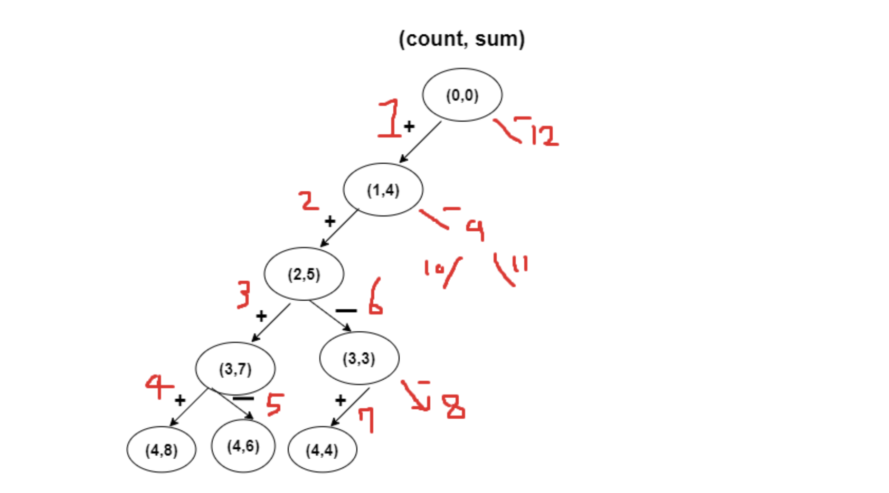

## ❌

### 풀이

```javascript
function solution(numbers, target) {
  let answer = 0;
  const length = numbers.length;

  function dfs(count, sum) {
    if (count === length) {
      if (target === sum) {
        answer++;
      }
      return;
    }

    dfs(count + 1, sum + numbers[count]);
    dfs(count + 1, sum - numbers[count]);
  }

  dfs(0, 0);

  return answer;
}
```

- 트리의 왼쪽 방향은 더하기, 오른쪽 방향은 빼는 것으로 진행한다.
- 각각 노드의 자식 노드를 탐색하는 함수를 스택에 추가한 뒤, 더 이상 자식 노드가 없을 때 마지막에 추가된 자식 노드 먼저 실행 후 스택에서 제거하는 후입선출(LIFO)
- 인덱스가 배열의 길이와 같다는 것은 배열의 맨 마지막 요소까지 모두 순회했다는 의미이다. 만약, 합이 타겟과 같다면 방법의 수를 올려주고, 그렇지 않으면 별도의 수행없이 함수를 빠져나온다.
<br>

### 작동 순서
- `numbers = [1, 1, 1, 1, 1]`
- `target = 3`


1. 인덱스가 배열을 모두 순회하기 전까지 순서대로 인덱스를 하나씩 올려준다. 처음에는 모든 요소를 더하는 연산을 수행한다.

```
// 작동 순서
// dfs(0, 0)
//   -> dfs(1 + 1, 0 + 1)
//     -> dfs(2 + 1, 1 + 1)
//       -> dfs(3 + 1, 2 + 1)
//         -> dfs(4 + 1, 3 + 1)
//           -> dfs(5, 4 + 1)   // 함수 종료
```

2. 이때, 인덱스가 배열의 마지막에 도달하면, 이전 인덱스에 해당하는 요소를 뺀 연산을 수행한다

```
// 작동 순서
// dfs(0, 0)
//   -> dfs(1 + 1, 0 + 1)
//     -> dfs(2 + 1, 1 + 1)
//       -> dfs(3 + 1, 2 + 1)
//         -> dfs(4 + 1, 3 + 1)
//           -> dfs(5, 4 + 1)   // 함수 종료
//         -> dfs(4 + 1, 3 - 1) // 뺄셈 연산 실행
//           -> dfs(5, 2 + 1)   // 함수 종료
```

3. 그리고 다시 인덱스가 마지막에 도달할 때까지 더하는 연산을 수행하다가 종료하면 빼는 연산을 반복한다

```
// 작동 순서
// dfs(0, 0)
//   -> dfs(1 + 1, 0 + 1)
//     -> dfs(2 + 1, 1 + 1)
//       -> dfs(3 + 1, 2 + 1)
//         -> dfs(4 + 1, 3 + 1)
//           -> dfs(5, 4 + 1)   // 함수 종료
//         -> dfs(4 + 1, 3 - 1) // 뺄셈 연산 실행
//           -> dfs(5, 2 + 1)   // 함수 종료
//       -> dfs(3 + 1, 2 - 1)   // 뺄셈 연산 실행
//         -> dfs(4 + 1, 1 + 1) // 덧셈 연산 실행
// ... 반복
```
[설명 출처](https://han-joon-hyeok.github.io/posts/programmers-target-number/)
<br>


[그림 출처](https://yong-nyong.tistory.com/41)

<br>


### 그냥 이진트리를 만들어버린 사람...
```javascript
function solution(numbers, target) {
    var answer = 0;
    var answer = 0;

    let root = new BinarySearchTree();
    root.insert(0);
    numbers.forEach(function(val) {
       root.insert(val); 
    });

    answer = root.DFSPreOrder(target);
    return answer;
}

class Node {
    constructor(value) {
        this.value = value;
        this.left = null;
        this.right = null;
    }   
}
class BinarySearchTree {
    constructor() {
        this.root = null;
    }
    insert(value) {
        let newNode = new Node(value);
        if(this.root === null) {
            this.root = newNode;
            return this;
        } else {
            let current = this.root;
            function traverse(node) {
                if(node.left) traverse(node.left);
                if(node.right) traverse(node.right);
                if(node.left === null) {
                    let leftNode = new Node(-value);
                    let rightNode = new Node(value);
                    node.left = leftNode;
                    node.right = rightNode;
                }
            }
            traverse(current);
            return this;
        }
    }
    DFSPreOrder(target) {
        let count = 0;
        let data = 0;
        let current = this.root;
        function traverse(node) {
            data = data + node.value;
            if(node.left) traverse(node.left);
            if(node.right) traverse(node.right);
            if(node.left === null) {
                if(data === target) {
                    count++;
                }
            }
            data = data - node.value;
        }
        traverse(current);
        return count;
    }
}
```