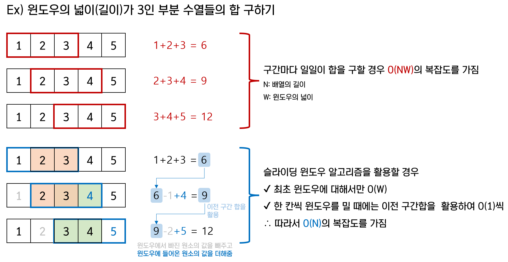

## ❌

### 슬라이딩 윈도우 알고리즘

- 길이(윈도우의 크기)가 1~n인 연속 부분 수열을 연속 부분 수열의 시작 지점만 바꿔가며 살펴보기
- for 문 및 slice 메서드로 덧셈하는 코드에 비해 훨씬 빠르다
  <br>


[이미지 출처](https://velog.io/@dianestar/%ED%94%84%EB%A1%9C%EA%B7%B8%EB%9E%98%EB%A8%B8%EC%8A%A4-%EC%97%B0%EC%86%8D-%EB%B6%80%EB%B6%84-%EC%88%98%EC%97%B4-%ED%95%A9%EC%9D%98-%EA%B0%9C%EC%88%98-JavaScript-%EA%B5%90%EA%B3%B5-%EC%95%8C%EA%B3%A0%EB%A6%AC%EC%A6%98-%EC%8A%A4%ED%84%B0%EB%94%94-48%EC%A3%BC%EC%B0%A8)
<br>

### 풀이 코드

```javascript
const solution = (elements) => {
  const sumSet = new Set();

  const len = elements.length;
  for (let i = 1; i <= len; i++) {
    let sum = 0;

    for (let j = 0; j < len; j++) {
      if (j === 0) {
        for (let k = 0; k < i; k++) {
          sum += elements[k];
        }
      } else {
        sum -= elements[j - 1];
        sum += elements[(j + i - 1) % len];
      }
      sumSet.add(sum);
    }
  }

  return sumSet.size;
};
```

<br>

### slice 메서드 + for문 덧셈 활용 코드(더 느림)

```javascript
const solution = (elements) => {
  const sumSet = new Set();

  const getSum = (arr) => {
    let sum = 0;
    for (let i = 0; i < arr.length; i++) sum += arr[i];
    return sum;
  };

  const len = elements.length;
  for (let i = 1; i <= len; i++) {
    for (let j = 0; j < len; j++) {
      if (j + i > len) {
        sumSet.add(
          getSum(elements.slice(j, len)) +
            getSum(elements.slice(0, j + i - len))
        );
      } else {
        sumSet.add(getSum(elements.slice(j, j + i)));
      }
    }
  }

  return sumSet.size;
};
```

### 다른 풀이

```javascript
function solution(elements) {
  const circular = elements.concat(elements);
  const set = new Set();
  for (let i = 0; i < elements.length; i++) {
    let sum = 0;
    for (let j = 0; j < elements.length; j++) {
      sum += circular[i + j];
      set.add(sum);
    }
  }
  return set.size;
}
```
